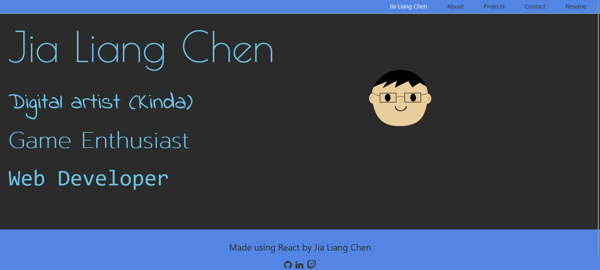
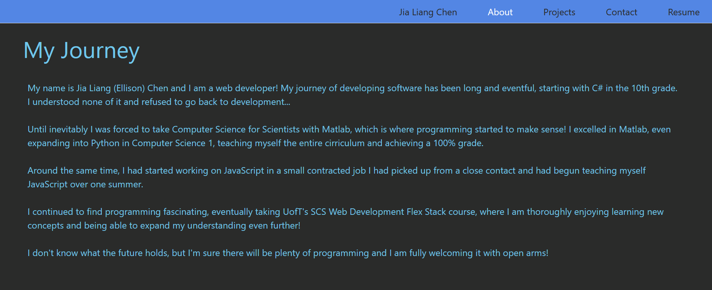
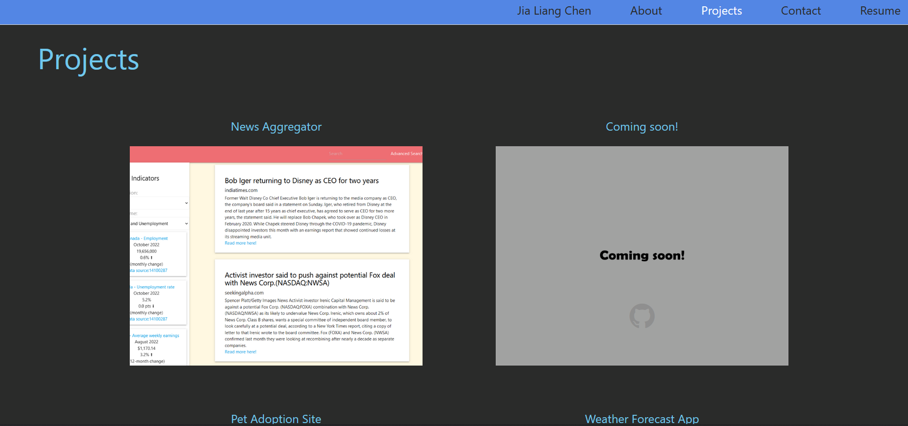
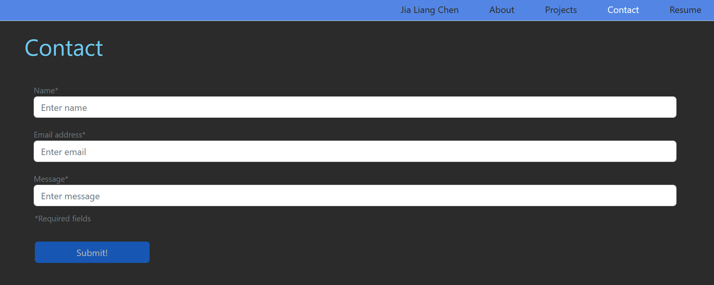
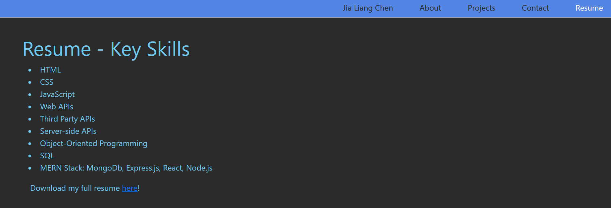

# React Portfolio

## Introduction

A portfolio made in React to show off programming capabilities.

## Table of Contents 
1. [Installation](#installation)
2. [Usage](#usage)
3. [Test](#test)
4. [Images](#images)
5. [Credits](#credits)
6. [Licenses](#licenses)

## Installation 

Clone repository from https://github.com/EllisJLC/Portfolio2.

Open the file directory and run command `npm install` to install necessary node modules.

## Usage

A display of my (Jia Liang Chen) programming capabilities

## Test

To run in local repository: Run command `npm start` in the working directory. 

Live site at https://ellisjlc.github.io/portfolio2/.

## Images

### Homepage

### About Me Page

### Projects Page

### Contact Page

### Resume Page

## Credits

All code was compiled by Jia Liang (Ellison) Chen, https://github.com/EllisJLC.

## Licenses 

The MIT License: https://opensource.org/licenses/MIT